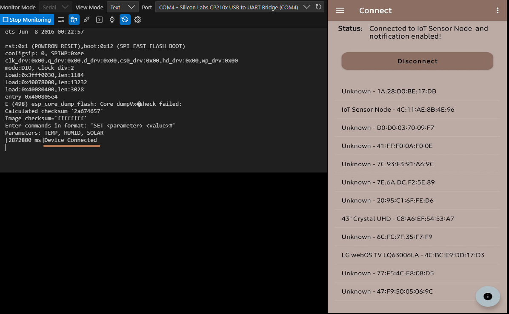
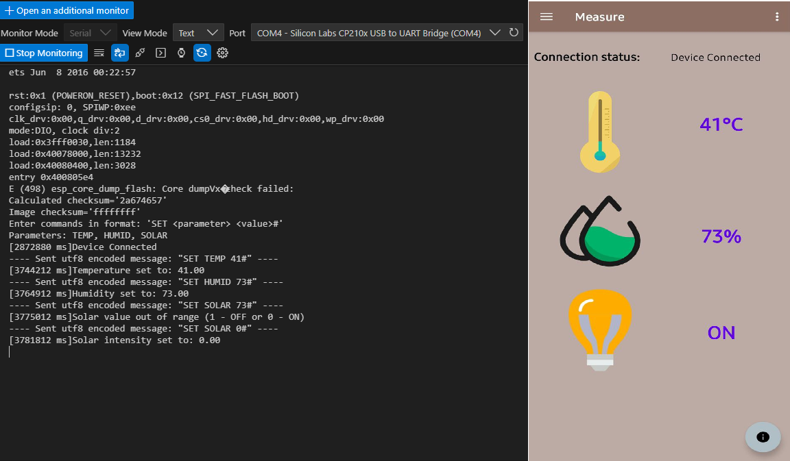

# ESP32 BLE Peripheral Application

# 📟 Embedded Project
Embedded application, based on ESP32 chip, designed to communicate via BLE with Android application installed on Android smartphone downloadable here https://github.com/MpDev89/ESP32_IoT_AndroidApp.git. ESP32 is designed to operate as BLE server to transmit data among an environmental sensing service composed from three characteristics (temperature, humidity and solar radiation). User can updated characteristics data using serial monitor.

## 🚀 Features
- ✅ Transmit BLE data through environmental sensing service.
- ✅ Serial monitor guide to update characteristics data

## 🚀 Code Features
- ✅ Abstraction layer for BLE protocol
- ✅ Abstraction layer for scheduler

## 🔧 Requirements
- Microcontroller: ESP32-WROOM-32
- Toolchain: VsCode + Extensions PlatformIO IDE
- Hardware:
  - Main Board: ESP32 NodeMCU
- Programming Interface: USB-UART

## 🛠️ Technologies
- Languages: C, C++
- Framework: Arduino
- Libraries: none

## 🏗️ Hardware Setup
It's consist in ESP32 NodeMCU

## 🏗️ Software Toolchain Setup
- Install VS-Code
- Install Extensions: PlatformIO IDE
- Push "PlatformIO" icon from primary side bar and click on "Pick a folder". You can open existing PlatformIO-based project (folder that contain platformio.ini file)

## 📦 Github Setup
Clone the repository:
```bash
git clone https://github.com/MpDev89/ESP32_BLE.git
cd project-name
```
## 🗒️ Results
Connect ESP32 NodeMCU to PC and open Serial Monitor.
Application is designed to accept data if received in a specific format: 'SET <parameter> <value>#' where parameter can be TEMP, HUMID, SOLAR.
On smartphone side download and install [Android application.](https://github.com/MpDev89/ESP32_IoT_AndroidApp/tree/3c57ac2ce29f552f0374a117baf161610bf1246f/build)
Follow instructions reported in the main application page and connect to device (IoT Sensor Node) as reported here:


From serial monitor change data using the commands with the format defined and verify that data is correctly transmitted to Android application.
The following image show data example:



## 🗒️ Licensing
This project includes code licensed under the Apache License 2.0.
See the LICENSE file for details.

## 🌐 Contatti
[](mailto:mp@tech-in-mind.it)  
[](https://www.linkedin.com/in/marconatale-parise-48a07b94)  
[](https://github.com/MpDev89)